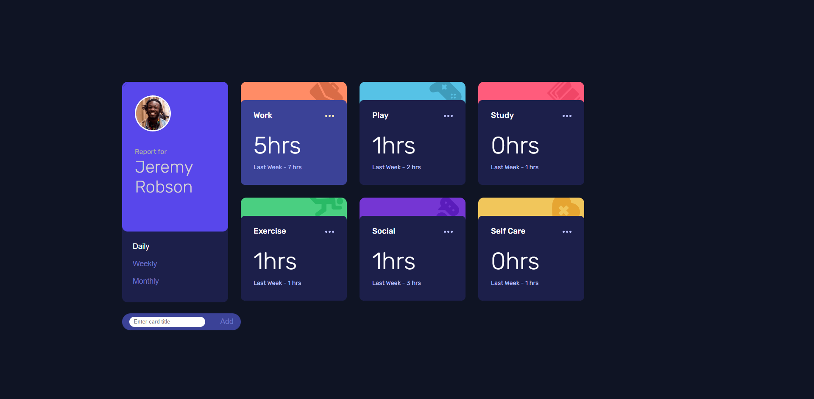
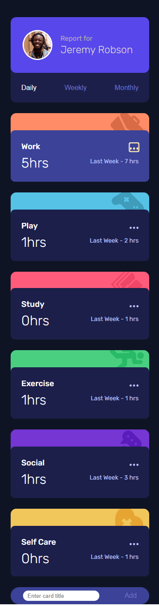

## Table of contents

- [Overview](#overview)
  - [The challenge](#the-challenge)
  - [Screenshot](#screenshot)
  - [Links](#links)
- [My process](#my-process)
  - [Built with](#built-with)
  - [What I learned](#what-i-learned)
  - [Continued development](#continued-development)
  - [Useful resources](#useful-resources)
- [Author](#author)

## Overview

### The challenge

Users should be able to:

- View the optimal layout for the site depending on their device's screen size
- See hover states for all interactive elements on the page
- Switch between viewing Daily, Weekly, and Monthly stats

### Screenshot




### Links

- Solution URL: [](https://github.com/Merlin033/Challenge-5-Time-tracking-dashboard.git)
- Live Site URL: [](https://challenge-5-time-tracking-dashboard.vercel.app/)

## My process

### Built with

- Semantic HTML5 markup
- CSS custom properties
- Flexbox
- CSS Grid
- Mobile-first workflow
- JavaScript

### What I learned

I learned to manipulate json data and inject html code from my script.jsfile. Specifically, I have incremented "card" containers with a function.
To train I even added a bonus feature that allows the user to add a custom card.

```js
// Get the "addCardBtn" element and add a click event listener to it.
const addCardBtn = document.querySelector("#addCardBtn");
addCardBtn.addEventListener("click", (event) => {
  // Prevent the default behavior of the event.
  event.preventDefault();

  // Get the value of the "newCardTitle" input field.
  const title = document.querySelector("#newCardTitle").value;

  // Add the new activity to the `timeTracking` array.
  timeTracking.push({
    title,
    timeframes: {
      daily: {
        current: 0,
        previous: 0,
      },
      weekly: {
        current: 0,
        previous: 0,
      },
      monthly: {
        current: 0,
        previous: 0,
      },
    },
  });
  console.log(timeTracking);
  // Call the updateCards function to update the UI
  updateCards();
```

### Continued development

Je dois continuer à manipuler les flexboxs et les grids pour que leur utilisation me vienne plus naturellement.

### Useful resources

- [Example resource 1](https://developer.mozilla.org/en-US/docs/Learn/JavaScript/Objects/JSON) - This site helped me understand and use json data.

## Author

- Frontend Mentor - [@Merlin033](https://www.frontendmentor.io/profile/Merlin033)
